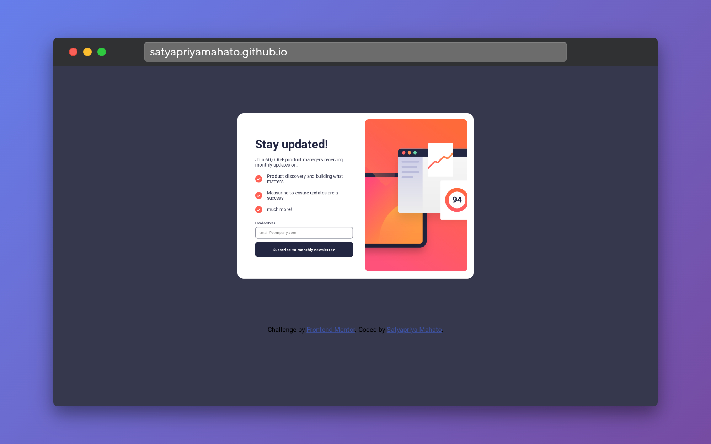

# Frontend Mentor - Newsletter sign-up form with success message solution

This is a solution to the [Newsletter sign-up form with success message challenge on Frontend Mentor](https://www.frontendmentor.io/challenges/newsletter-signup-form-with-success-message-3FC1AZbNrv). Frontend Mentor challenges help you improve your coding skills by building realistic projects. 

## Table of contents

- [Overview](#overview)
  - [The challenge](#the-challenge)
  - [Screenshot](#screenshot)
  - [Links](#links)
- [My process](#my-process)
  - [Built with](#built-with)
  - [What I learned](#what-i-learned)
  - [Continued development](#continued-development)
  - [Useful resources](#useful-resources)
- [Author](#author)

## Overview

### The challenge

Users should be able to:

- Add their email and submit the form
- See a success message with their email after successfully submitting the form
- See form validation messages if:
  - The field is left empty
  - The email address is not formatted correctly
- View the optimal layout for the interface depending on their device's screen size
- See hover and focus states for all interactive elements on the page

### Screenshot



Add a screenshot of your solution. The easiest way to do this is to use Firefox to view your project, right-click the page and select "Take a Screenshot". You can choose either a full-height screenshot or a cropped one based on how long the page is. If it's very long, it might be best to crop it.

Alternatively, you can use a tool like [FireShot](https://getfireshot.com/) to take the screenshot. FireShot has a free option, so you don't need to purchase it. 

Then crop/optimize/edit your image however you like, add it to your project, and update the file path in the image above.


### Links

- Solution URL: [Solution](https://github.com/SatyapriyaMahato/news-letter-signup-with-success-page)
- Live Site URL: [Live Site](https://satyapriyamahato.github.io/news-letter-signup-with-success-page/)

## My process

### Built with

- Semantic HTML5 markup
- CSS custom properties
- Flexbox


### What I learned

Use of jaavscript function in different ways. In this i use the display property to toggle the different element tooshow. Also i used the  onclick refressh method ``` onclick="window.location.reload();" ``` to refresh the page.


### Continued development

I will explore move javascript projects to gain more confidenece


### Useful resources

- [Mdn docs](https://developer.mozilla.org/en-US/)and will use it going forward.
- [w3 schools](https://www.w3schools.com/)


## Author

- Frontend Mentor - [@SatyapriyaMahato](https://www.frontendmentor.io/profile/SatyapriyaMahato)
- Twitter - [@satyapriyamahto](https://www.twitter.com/satyapriyamahto)


